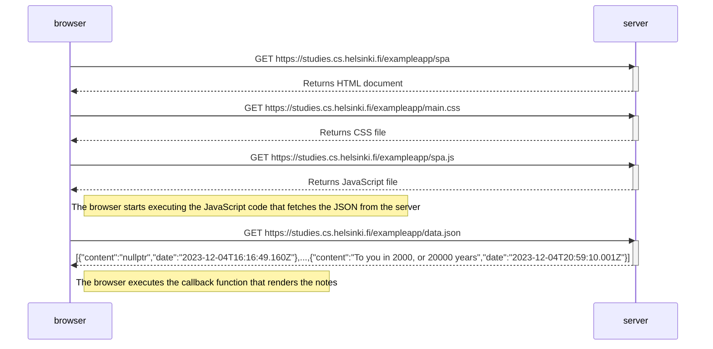

Used examples from:
https://fullstackopen.com/osa0/web_sovelluksen_toimintaperiaatteita

```mermaid
sequenceDiagram
    participant browser
    participant server

    browser->>server: GET https://studies.cs.helsinki.fi/exampleapp/spa
    activate server
    server-->>browser: Returns HTML document
    deactivate server

    browser->>server: GET https://studies.cs.helsinki.fi/exampleapp/main.css
    activate server
    server-->>browser: Returns CSS file
    deactivate server

    browser->>server: GET https://studies.cs.helsinki.fi/exampleapp/spa.js
    activate server
    server-->>browser: Returns JavaScript file
    deactivate server

    Note right of browser: The browser starts executing the JavaScript code that fetches the JSON from the server

    browser->>server: GET https://studies.cs.helsinki.fi/exampleapp/data.json
    activate server
    server-->>browser: [{"content":"nullptr","date":"2023-12-04T16:16:49.160Z"},...,{"content":"To you in 2000, or 20000 years","date":"2023-12-04T20:59:10.001Z"}]
    deactivate server

    Note right of browser: The browser executes the callback function that renders the notes
```
