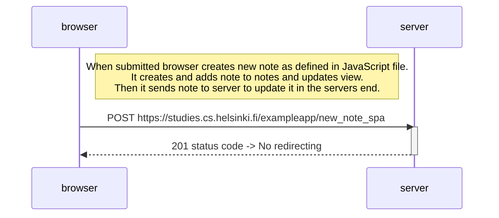

```mermaid
sequenceDiagram
    participant browser
    participant server

    Note right of browser: When submitted browser creates new note as defined in JavaScript file. <br> It creates and adds note to notes and updates view. <br> Then it sends note to server to update it in the servers end.

    browser->>server: POST https://studies.cs.helsinki.fi/exampleapp/new_note_spa
    activate server
    server-->>browser: 201 status code -> No redirecting
    deactivate server
```
